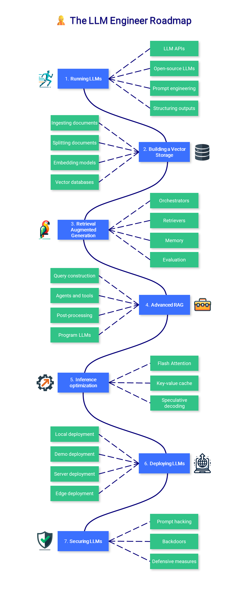

# 🚀 LLM Engineer Roadmap (10-Day Learning Challenge)

這是一個 10 天完成的高強度學習計劃，目標是掌握 **LLM 工程師完整技能樹**，並最終完成一個 **安全的文件問答系統 (Secure RAG System)**。

## 🧑‍💻 專案目標
- 學習並實作 **圖片中的所有技能**（Running LLMs → Vector Storage → RAG → Inference Optimization → Deployment → Security）。
- 每天完成一個 milestone，並 push 到 GitHub。
- 10 天後產出 **可運行的端到端 LLM 應用**，作為 Portfolio 展示。

---

## 🗺️ 學習範圍
### 1. Running LLMs
- LLM APIs / Open-source LLMs  
- Prompt engineering  
- Structuring outputs  

### 2. Building Vector Storage
- Ingesting & Splitting documents  
- Embedding models  
- Vector databases  

### 3. Retrieval Augmented Generation (RAG)
- Orchestrators  
- Retrievers  
- Memory  
- Evaluation  

### 4. Advanced RAG
- Query construction  
- Agents and tools  
- Post-processing  
- Program LLMs  

### 5. Inference Optimization
- Flash Attention  
- Key-value cache  
- Speculative decoding  

### 6. Deploying LLMs
- Local / Demo / Server / Edge deployment  

### 7. Securing LLMs
- Prompt hacking  
- Backdoors  
- Defensive measures  

---

## 📅 每日任務計劃

### **Day 1 – Running LLMs**
- 呼叫 OpenAI API & HuggingFace LLM  
- 嘗試 prompt engineering（不同格式 JSON / 指令）  
- **Commit**: `day1: running LLMs with APIs & prompts`

### **Day 2 – Building Vector Storage**
- Ingest PDF → chunk → embedding → FAISS  
- Similarity search 測試  
- **Commit**: `day2: vector storage with FAISS`

### **Day 3 – Retrieval Augmented Generation (RAG)**
- 基礎 RAG 系統（文件檢索 + LLM 回答）  
- 加入 Memory 功能  
- **Commit**: `day3: basic RAG system`

### **Day 4 – Advanced RAG**
- Query rewriting  
- 建立多工具 Agent  
- **Commit**: `day4: advanced RAG with agents`

### **Day 5 – Inference Optimization**
- 測試 kv-cache / flash attention / speculative decoding  
- 比較推理速度  
- **Commit**: `day5: inference optimization experiments`

### **Day 6 – Deploying LLMs (基礎)**
- Gradio Chatbot UI  
- Dockerize 專案  
- **Commit**: `day6: gradio demo & dockerization`

### **Day 7 – Deploying LLMs (進階)**
- 部署到 AWS EC2（FastAPI + Docker）  
- 測試 GGUF 量化模型  
- **Commit**: `day7: cloud deployment`

### **Day 8 – Securing LLMs (攻擊面)**
- 測試 jailbreak prompt  
- Injection 攻擊實驗  
- **Commit**: `day8: prompt attack testing`

### **Day 9 – Securing LLMs (防禦面)**
- 輸入檢查 + 輸出過濾  
- Guardrails & Content filter  
- **Commit**: `day9: security defenses`

### **Day 10 – Final Project**
- 整合 RAG + 部署 + 安全防禦  
- Demo: Secure Document QA System  
- **Commit**: `day10: final secure document QA system`

---

## 🎯 最終成果 Showcase
✅ Secure Document QA System  
- 文件上傳 → 自動分割 & embedding  
- 向量資料庫檢索  
- RAG + LLM 回答  
- Gradio UI 展示  
- Docker & AWS 部署  
- Prompt 安全防護  

---

## ⚡ 技術棧
- **LLM APIs**: OpenAI, HuggingFace  
- **Frameworks**: LangChain, LlamaIndex  
- **Vector DB**: FAISS, Chroma  
- **Deployment**: Gradio, FastAPI, Docker, AWS  
- **Security**: Prompt filtering, Guardrails  

---

📌 計劃為期 10 天，每天完成一個 milestone，最後完成一個 **可展示的端到端專案**。
